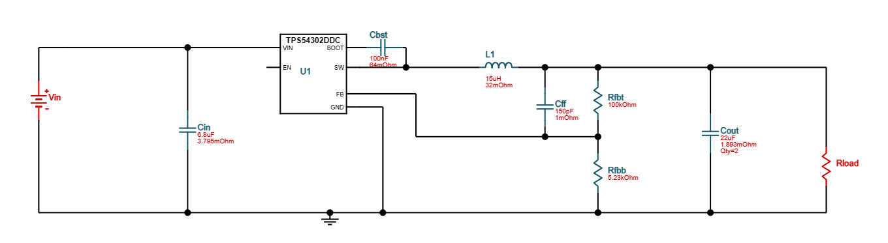
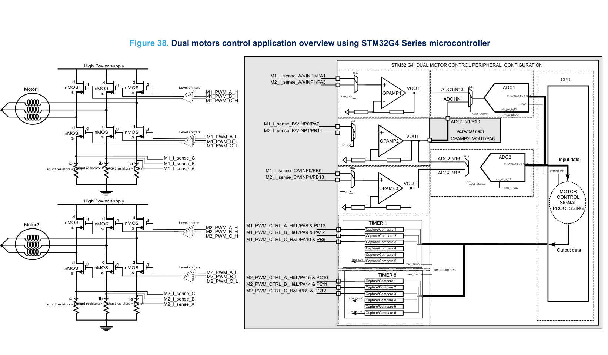
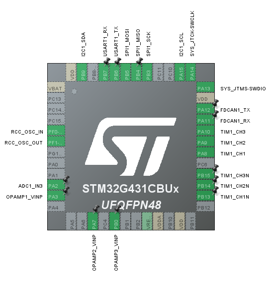
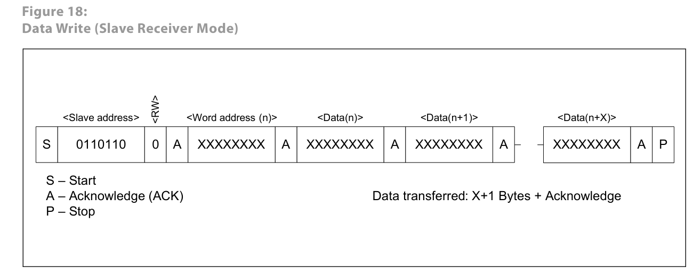
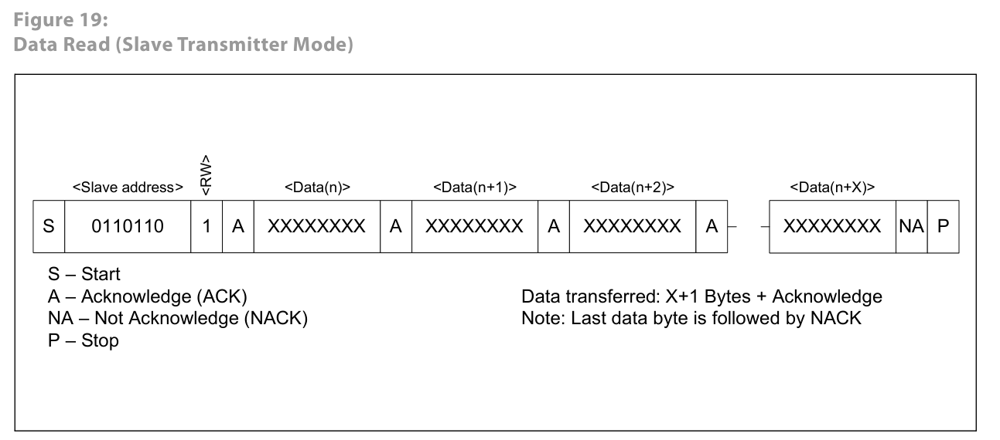
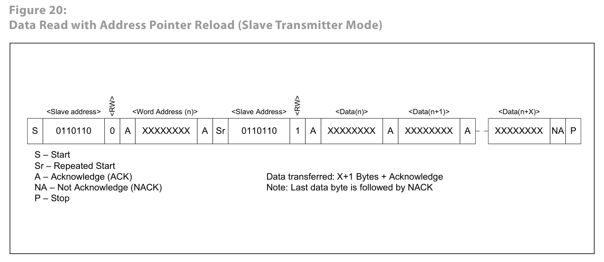
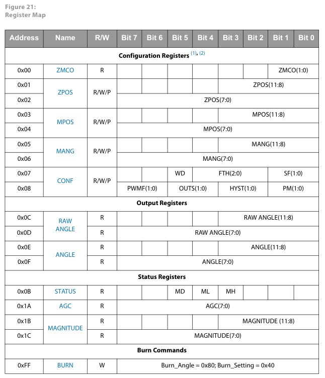

[TOC]

# 轮腿方案

## FOC硬件设计

### 栅极驱动

#### EG2133：[EG2133 | EGmicro](https://www.egmicro.com/chip-centers/55/EG2133/)

#### FD6288Q[FD6288Q_（Fortior Tech(峰岹)）FD6288Q中文资料_价格_PDF手册-立创电子商城 (szlcsc.com)](https://item.szlcsc.com/308367.html)

### MOS

[WSD4070DN](https://item.szlcsc.com/761892.html)（栅极电压可达20V MAX，12V Typical）

5c410（大功率、淘宝拆机）[基于BLHeli_S固件的四合一电调（ESC）30.5mm版本 - 嘉立创EDA开源硬件平台 (oshwhub.com)](https://oshwhub.com/mtbsk8/ji-yu-blheli-gu-jian-de-si-he-yi-wu-shua-dian-ji-dian-diao-esc-30-5mm-ban-ben)

KNY3406C

### 电流采样运放

单FOC：

​	stm32g431内部的3运放。

多FOC：

​	TP2604-SR（参考Cheaper FOC）

​	RS622XTDE8（DFN封装）

### 栅驱电源

电感：[一体成型贴片屏蔽电感0420 0520 0530 0630 0650 1040 1265 1770-淘宝网 (taobao.com)](https://item.taobao.com/item.htm?ali_refid=a3_430582_1006:1121364908:N:hx5UWap32YznrYDz9EO0IA==:34664e040420ff6e1b0507b3390032ed&ali_trackid=1_34664e040420ff6e1b0507b3390032ed&id=611551715775&skuId=4475071927845&spm=a21n57.1.0.0)

使用 15uH, 0630封装

### 电流采样

目前有两种低端采样的方案。

#### 1. 双/三电阻采样 + 差分放大

这种方案要考虑负电流的情况，因此使用带电压偏置的差分放大电路。查阅网上大部分开源方案都是这种，odrive3.5使用的就是双电阻采样+差分，对两相电流（有正有负）进行采样，另一相可以由基尔霍夫电流定律（三相电流和为零）间接算出。

#### 2. 三电阻采样 + 同相比例放大

ST方案，来自 [dm00605707-operational-amplifier-opamp-usage-in-stm32g4-series-stmicroelectronics](https://www.st.com/resource/en/application_note/dm00605707-operational-amplifier-opamp-usage-in-stm32g4-series-stmicroelectronics.pdf) 这篇文档的33页。

在下管全部开启时，总是有两相电流为正，一相电流为负，一共六种情况，与svpwm的6个sector对应，因此只需对两相正电流进行采样，另一相可以由基尔霍夫电流定律（三相电流和为零）间接算出。

这种方案不需要偏置电压。可以很好地利用stm32g431的三运放资源，通过运放输入的MUX，还可以轻松实现双FOC驱动。

两种方案对于硬件资源的利用各有千秋，方案一可以少一路采样电阻，方案二则必须使用三电阻采样，但不需要产生额外的偏置电压，由于stm32g431的硬件特性，选用方案二。

## 单电机FOC硬件设计

该方案每个电机一个MCU，各电机之间使用CAN通信。

### Feature

三电阻采样，使用stm32g431内部的三运放

1路ADC用于母线电压采样，电池电压变化时可进行补偿

一路IIC用于AS5600磁编码器

一路串口

一路FDCAN/CAN

SW调试接口

一路双工SPI（预留SPI屏幕）

8M外部晶振

剩余IO引出

### Pin Map

### 磁编码器AS5600

#### IIC总线定义

**总线空闲IDEL：** SDA和SCL都是高电平。

**开始传输START：** SCL为高时，SDA从高到低。

**停止传输STOP：** SCL为高时，SDA从低到高。

**数据有效：** 每次传输都以 START 开始，STOP 结尾，这之间的传输字节数由主机控制，不受限制。在SCL为高时，SDA必须保持稳定，否则会被误认为 START 或 STOP。传输以字节为单位，并且接收方在每个字节的结尾（第9位）发送一个ACK。

**响应ACK：** 发送端占用SDA完成8bit数据传输后，会释放SDA（默认上拉），接收方需要在第9bit拉低SDA，作为一个ACK。主机在读操作的最后一个字节后产生一个NOT ACK，这时从机会继续保持释放总线，主机产生STOP，结束本次读取。

**主机写从机：** 主机发送的第一个字节是从机的7bit地址+1bit读写位，接下来就是数据字节，从机在每个字节后发送ACK，如果数据或命令不合法则发送NACK，数据的字节序是MSB。

**主机读从机：** 同上先发送1byte 地址+读写位，从机需要ACK一下，接下来从机发送数据（SCL仍然是主机控制），主机在每个字节后回复ACK，最后一个字节主机发送一个NACK，接着STOP或下一个START。

#### AS5600 IIC 传输时序

除了IIC的device address，AS5600还存在一个word address，位于 **写操作** 的第一个字节，用于选择AS5600的寄存器，在一个字节的读或写完成时，该word address pointer 将自动递增。当word address pointer 无效时，返回NACK。

**WRITE：** 主机发送地址0x36+1'b0，从机ACK，主机发送word address（表示接下来访问的寄存器的地址），从机ACK（若地址无效则NACK），主机发送数据，从机的word address pointer每个字节都自增（无论word address是否有效），若word address则从机ACK，否则NACK，主机发送STOP，完成。

**READ：** 同上发送首字节，从机ACK，从机发送word address pointer指向的数据，主机ACK，主机拿到最后一个字节后，发送NACK，从机释放SDA，主机STOP。

**word address pointer reload（完整的读时序）：** 每次先重写一下word address pointer，再读。

#### 寄存器：

对于寄存器的写入，应该先将寄存器读出，仅修改要改动的位，再写入。

安装时需要调整AS5600到磁铁的间隔，STATUS寄存器可查看当前磁铁的距离太近/太远/合适，再精细调整使AGC寄存器处于中间值。

对于不需要使用完整360°的应用，可以设定AS5600角度范围，使12位精度映射到需要的范围内，从而提高精度，角度范围需要大于18°。对于FOC，应该设定一个 (360/极对数) * 4096 * n（n=...、1/4、1/3、1/2、1、2、3...）的范围，方便进行角度换算。

OTP只能烧写3次，所以不用了，每次上电重新写就行。

#### AS5600 特性：

IIC接口最大频率为1M，连续读取角度时，每次大概需要30个cycle，因此最高角度刷新频率为30Khz左右。

IIC地址固定为0x36 (0110110)，无法修改，因此每个AS5600都需要占用一个IIC，这对多路FOC很不友好，可以考虑采用PWM和模拟输出的方式。

MAGNITUDE是磁场的幅值，可以用于接近检测等应用，比如按键按下可以用这个进行判断。

word address pointer自增时，如果需要读同一个寄存器，就需要每次都通过一次写操作重置word address pointer，对于ANGLE、RAW ANGLE、MAGNITUDE 寄存器，word address pointer不会自增，准确来说是读出两字节后重置，这样重复读取这些寄存器就省去写操作了。

